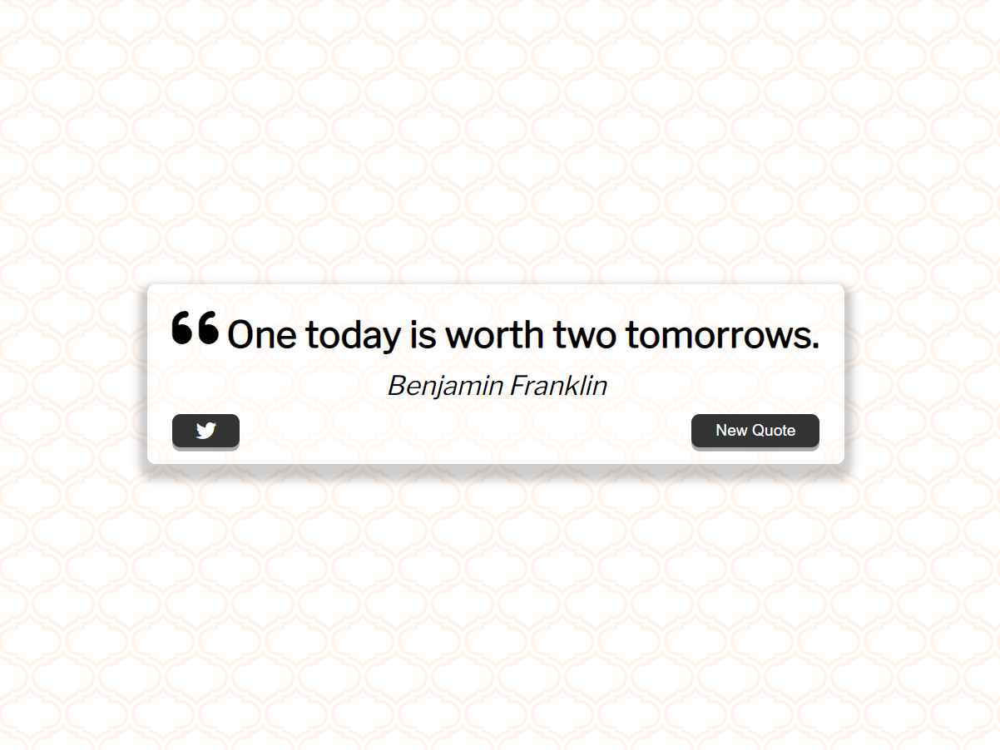
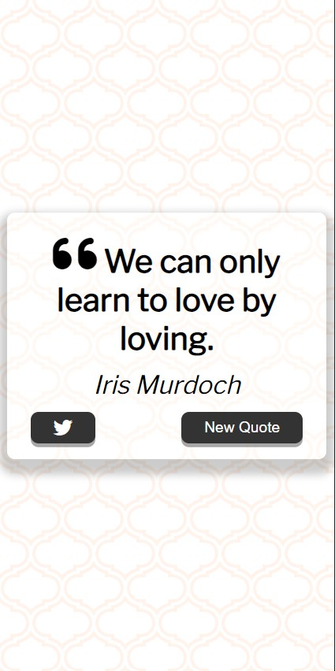

# QUOTE GENERATOR<!-- omit in toc -->

 

## Version 1.0<!-- omit in toc -->

- **Project Start:** July 6, 2022
- **Project End:** July 7, 2022

 

# CONTENTS
- [CONTENTS](#contents)
  - [Introduction](#introduction)
  - [Screenshots](#screenshots)
    - [DESKTOP](#desktop)
    - [MOBILE](#mobile)
  - [Methodology](#methodology)
  - [Tools Used](#tools-used)
  - [What I learned](#what-i-learned)
  - [Items for further study](#items-for-further-study)
  - [About me](#about-me)
 

Introduction
---

This is the first project from the excellent **JavaScript Web Projects: 20 Projects to Build Your Portfolio** from the awesome [Zero To Mastery website](https://zerotomastery.io/).

This project makes a fetch request to a Quote API and presents the user with a random quote from the JSON response received. The user can then generate another quote, or tweet out the quote 

 

Screenshots
---

### DESKTOP

### MOBILE

 

Methodology
---

I followed the tutorial from beginning to end; only making changes to the background and fonts chosen during the initial setup.

After the initial setup, which included choosing a background pattern from [Hero Patterns Background](https://www.heropatterns.com/) and fonts from Google Fonts, we moved on to the JavaScript where we made a call to the [Inspirational Quotes API](https://quotes-react.netlify.app/), and choose a random quote to display one of the available quotes.

The Buttons to Tweet out the Quote and to generate a new quote were then wired up. The documentation referenced for making the Tweet Quote button work can be found [here](https://developer.twitter.com/en/docs/twitter-for-websites/tweet-button/guides/web-intent).

 

Tools Used
---

- HTML5
- CSS 3
- Vanilla JavaScript with Async/Await

 

What I learned
---

I'm always keen to practice using Async/Await, and this was the perfect little project to review how.

I don't think I've ever built a project with the ability to Tweet things out, so it was nice to see how simple it was to add that functionality.

Stylistically, 

 

Items for further study
---

For this, I would like to add a way for users to Favourite the quotes they like. For this, I'll have to add some sort of register capabilities, I think.

 

About me
---

Thanks for checking out this project! 😃 You can find my profiles at these sites:
- [Personal Portfolio](https://www.sonjigoodman.com)
- [Twitter: @IT_Sonji](https://twitter.com/sonji_it)
- [Frontend Mentor - @infinity-Mineeva](https://www.frontendmentor.io/profile/Infinity-Mineeva)